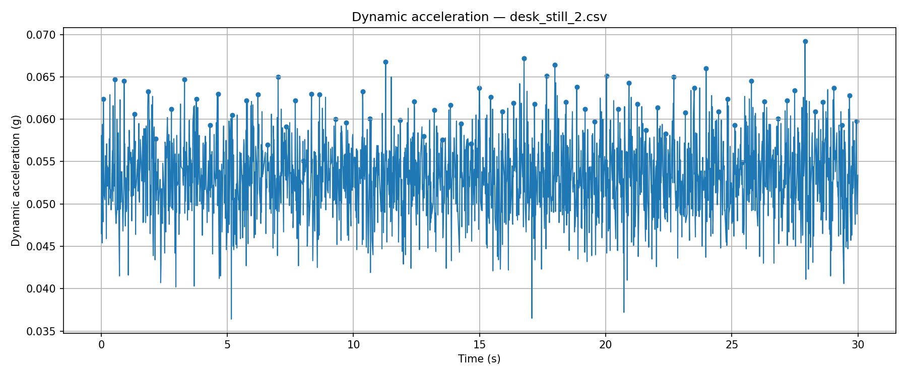
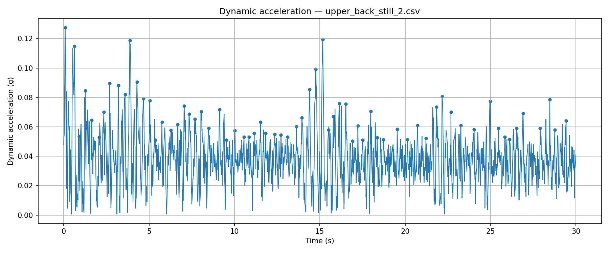
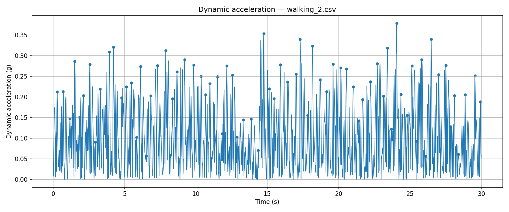

# Sports Fitness Tracker

A wearable IMU-based sports performance logger for hockey and running.

The project uses an ESP32, MPU6050 inertial sensor and MicroSD card module to collect acceleration and gyroscope data, then analyses the data in Python to estimate movement intensity, PlayerLoad, cadence and activity patterns.

## Current Status
- ESP32 successfully logging MPU6050 data to MicroSD
- Stable sample rate of approximately 83 Hz achieved
- Initial stationary and walking trials completed
- Python analysis pipeline calculates dynamic acceleration, PlayerLoad and dominant frequency
- Battery power system and GPS integration are currently in development
## Development Status

| Stage | Status | Notes |
|---|---|---|
| IMU wiring | Complete | MPU6050 connected over I2C |
| SD logging | Complete | CSV logging working |
| Python analysis | Complete v1 | PlayerLoad, dynamic acceleration and dominant frequency calculated |
| Battery power | In progress | LiPo, TP4056 and boost converter stage |
| Wearable enclosure | Planned | Compression vest/back-mounted unit |
| GPS | Planned | NEO-6M module for distance/speed tracking |

## Firmware

The current firmware is a timed ESP32 logger located at:

`firmware/imu_sd_timed_logger/imu_sd_timed_logger.ino`

It logs MPU6050 accelerometer and gyroscope readings to a CSV file on the MicroSD card. The current version starts automatically, records for a fixed duration and safely closes the file at the end of the session.

# Analysis

This folder contains Python scripts used to process CSV data from the ESP32 sports tracker.

## `imu_compare.py`

Compares three validation trials:

- `desk_still_2.csv`
- `upper_back_still_2.csv`
- `walking_2.csv`

The script calculates sample rate, dynamic acceleration, PlayerLoad, peak count and dominant frequency. It also generates summary plots for each trial.

## Running the script

```bash
python imu_compare.py


## Initial IMU Validation Results

| Test | Sample Rate | Mean Dynamic Acceleration | Max Dynamic Acceleration | PlayerLoad | Dominant Frequency |
|---|---:|---:|---:|---:|---:|
| Desk still | 83.33 Hz | 0.053 g | 0.069 g | 17.57 | 8.25 Hz |
| Upper-back still | 83.33 Hz | 0.039 g | 0.127 g | 31.76 | 3.22 Hz |
| Walking | 83.33 Hz | 0.105 g | 0.379 g | 161.20 | 2.04 Hz |

The walking trial produced approximately 5× greater PlayerLoad than the upper-back still trial and approximately 9× greater PlayerLoad than the desk-still trial. The dominant frequency of 2.04 Hz corresponds to approximately 122 steps/min, which is plausible for walking cadence.


## Validation Plots

#### Desk still


#### Upper-back still


#### Walking

